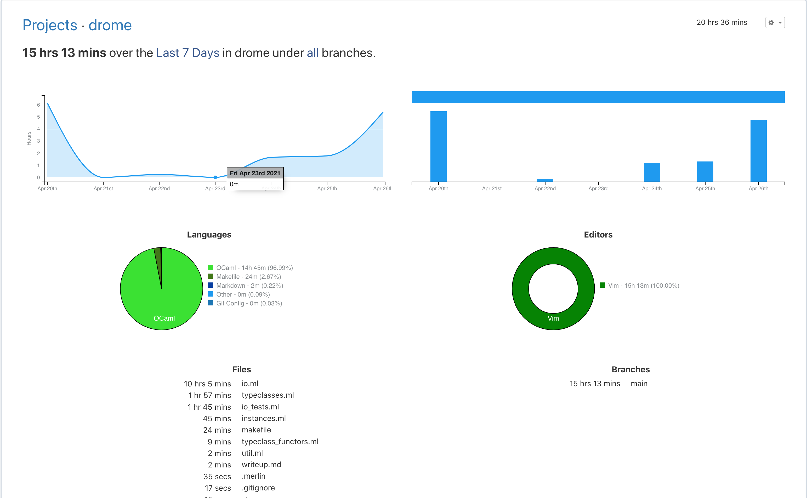

Narek Asadorian \
CSCI E-51, Spring 2021

---

# drome: monadic effects for OCaml 

## Abstract

TODO: Rewrite proposal as abstract

## Milestones

* April 26th, 2021
  * IO
    - [x] Complete unsafe synchronous DSL implementation
    - [x] Add delay and error handling capabilities
    - [x] Begin writing tests
  * Resource
    - [ ] Sketch out Resource DSL signature
  * Demo program
    - [x] Come up with demo idea to implement via IO and Resource
  * Typeclass
    - [x] Can combinator functionality (bind, map, etc) be captured in shared sig? Do not need a fully fledged typeclass hierarchy.

* May 1, 2021
  * IO
    - [ ] Complete asynchronous DSL interpreter (priority TBD)
    - [ ] Complete test suite
    - [x] Optimizations (map fusion, tail recursive interpreter)
    - [ ] More combinators (`ap`, `ap2`, `zip`, etc)
  * Resource
    - [ ] Complete DSL, including functions `make` & `use`. Interpreter
        should target `IO` runtime.
    - [ ] Test suite
  * Demo program
    - [ ] Begin writing
  * Project writeup
    - [ ] Write outline
    - [ ] Rewrite abstract

* May 5, 2021
  * Demo program
    - [ ] Complete and working
  * Project writeup
    - [ ] Complete writing 

## Midpoint Checkin (April 27, 2021)

### Summary

My implementation of the `IO` monad is called `drome`, named after the Dromedary camel used widely in Africa. My approach is loosely inspired by the one taken seen in Scala's [cats-effect](https://github.com/typelevel/cats-effect) library, which is to encode all possible actions in a single free algebra and interpret it with various runtimes. The key difference in my implementation however is that I'm using OCaml's generalized algebraic datatype (GADT) capabilities whereas the Scala version relies heavily on object oriented patterns and JVM specific hacks. I've found my version so far to be elegant and more readable than the `cats-effect`'s source code, with a predicted tradeoff being runtime performance.

I've spent 20+ hours on this project so far, with a majority of the time being
spent writing and debugging the `IO` DSL interpreter.

_Time spent on the project so far, via WakaTime_



### Implementation so far

Thus far, I have written a number of constructors which enable the basics of
monadic IO programs as well as a synchronous interpreter function called
`unsafe_run_sync`. Given that I haven't used GADTs in OCaml up until this project, I've found that interpreting a GADT is much more mind-bending than a traditional ADT. In `unsafe_run_sync` I specifically had issues when implementing "trampolining" for the `Bind` constructor, as well as understanding why `Attempt`'s implementation is simpler than I expected after spending multiple hours fighting the compiler.

I've also elected to represent some of the more useful typeclasses which `IO`
admits, from `Functor` all the way to `MonadError`. I've structured these
typeclasses as module signatures, with a handful of module-functors which can
derive them from more powerful implementations (e.g. `Applicative` can be written via `Monad`).

The only shortcoming so far is that there hasn't been much progress on the
`Resource` module I wanted to write, which encapsulates `try-catch-finally`
behavior. Thus far I only have `try-catch` in the form of `attempt`, so I will
likely take some of the lessons learned from that aspect when working on
`Resource`. Also while I've written a handful of tests for my own sanity, I have not gone the full length I'd like to for this project. I expect a larger focus on testing and example programs in the coming week.

### Moving Forward

Most of the milestones already determined in the above section will stay in place. In the coming week I will be working on organizing my code into the mentioned typeclasses, writing more tests, and beginning work on the `Resource`
capability. Once the implementation code is in a good state, I will move on to
writing example programs and determine how far I want to go with the asynchronous interpreter.

## Demo Programs

__Echo loop with IO__

```ocaml
  let read : string io = IO.suspend read_line
  let print (s : string) : unit io = IO.suspend (fun _ -> print_endline s)
  
  (* Combine read and print infinitely using bind and productL *)
  let rec echo : unit io = IO.( (read >>= print) *> echo )

  (* Run synchronously *)
  utop # IO.unsafe_run_sync echo
  <in>hi
  hi
  <in>there
  there
  ^CInterrupted.
```

__Pure functional retry__

```ocaml
  open Cohttp_lwt_unix;;

  (* GET a URL and convert its status to an integer *)
  let status_of_url (url : string) : int io =
    IO.suspend (fun _ ->
      Client.get (Uri.of_string url)
        |> Lwt_main.run
        |> fst
        |> Response.status
        |> Code.code_of_status
    )

  (* Handle errors using the `attempt` combinator and return Ok when 200 *)
  let rec retry_til_ok (n : int) (url : string) : ((exn, int) result) io =
    if n = 0 then IO.pure @@ Result.Error "Could not get 200"
    else IO.(attempt (status_of_url url) >>= (
      function
        | Result.Ok 200 as ok -> IO.pure ok
        | _ -> retry_til_ok (n - 1) url
    ))
    
```

